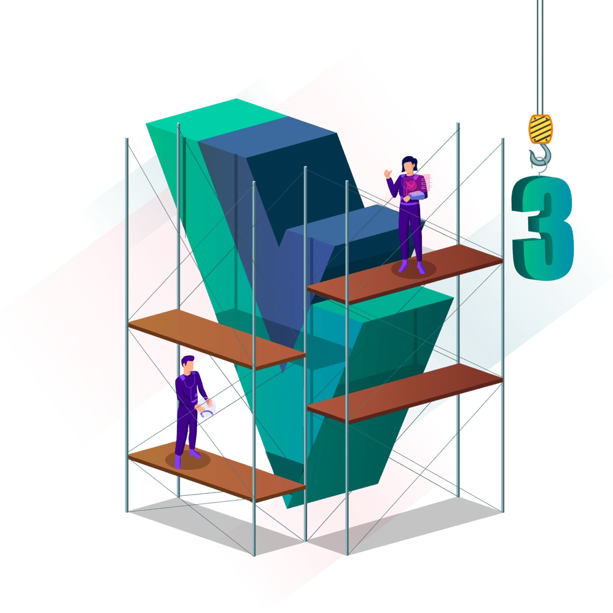

<!-- BACK TO TOP -->

<!-- PROJECT LOGO -->
 

  

  <h3 align="center">Vue.js Flexible Components</h3>

  

    Explorando técnicas avançadas para o desenvolvimento de componentes reutilizáveis
     
    <a href="#sobre-o-projeto">
      <strong>Acesse a documentação »</strong>
    </a>
  

<!-- TABLE OF CONTENTS -->

  
Sumário

  <ol>
    <li>
      <a href="#sobre-o-projeto">Sobre o projeto</a>
      <ul>
        <li><a href="#introdução">Introdução</a></li>
        <li><a href="#a-stack">A stack</a></li>
      </ul>
    </li>
    <li><a href="#roadmap">Roadmap</a></li>
    <li><a href="#licença">Licença</a></li>
    <li><a href="#contato">Contato</a></li>
  </ol>

<!-- ABOUT THE PROJECT -->
## Sobre o projeto

O projeto consiste basicamente de uma apresentação em slides, criada utilizando o [slidev](https://sli.dev/) seguida de alguns exemplos práticos e demonstrações de diferentes versões de componentes, abordando os tópicos detalhados a seguir.

Para consultar o repositório da __apresentação__, [clique aqui](./slidev/README.md). 
Para consultar o repositório das __demos__, [clique aqui](./demos/README.md).

(<a href="#readme-top">voltar para o topo</a>)

### Introdução

Nesta talk iremos abordar alguns tópicos e abordagens pertinentes no que se refere ao desenvolvimento de componentes Vue.js mais flexíveis.

Nela, abordaremos itens como:
* Anti-patterns:
  * _Props Explosion_: Customização de estilos, comportamento e renderizações dentro do componente fazendo uso de uma quantidade excessiva de _props_;
  * Vulnerabilidades a ataques XSS: Blocos HTML sendo passado via _props_, resultando em riscos de ataques XSS e _issues_ apontadas pelas ferramentas de _lint_, (sonarcloud, por exemplo);
  * Múltiplo _binding_ de props: Não utilização de diretivas como `v-bind="props"` e `v-on="listeners"`, por exemplo.
* Gerenciamento de estilos: Controle condicional de classes e estilos;
* Gerenciamento de comportamentos: Controle de eventos, renderizações dinâmicas e entre outros;
* Demonstração de um exemplo real de componente não flexível;
* Resolução dos problemas e _anti-patterns_ mencionados anteriormente:
  * Utilização mais limpa das _props_;
  * Utilização de _named slots_;
  * Utilização de _scoped slots_;
  * Aplicação da técnica de _renderless components_;
  * Criação de _wrapper components_.

(<a href="#readme-top">voltar para o topo</a>)

### A stack

Para o desenvolvimento da apresentação e das demonstrações que irão compor essa talk, utilizamos as seguintes tecnologias em nossa stack:

[![Typescript][Typescript]][Typescript-url] 
[![Vue][Vue.js]][Vue-url] 
[![Vite][Vite.js]][Vite-url] 
[![Tailwind][TailwindCSS]][Tailwind-url] 

(<a href="#readme-top">voltar para o topo</a>)

<!-- ROADMAP -->
## Roadmap

- [x] Criação do repositório padrão;
- [x] Criar e configurar os repositórios internos (slides e demos);
- [ ] Preparar a documentação e guias de instalação;
- [ ] Preparar a apresentação teórica;
- [ ] Preparar as demonstrações práticas;

(<a href="#readme-top">voltar para o topo</a>)

<!-- LICENSE -->
## Licença

Distribuído mediante licença MIT. Consulte `LICENSE.txt` para maiores informações.

(<a href="#readme-top">voltar para o topo</a>)

<!-- CONTACT -->
## Contato

Leonardo Adamoli - [leosadamo](https://www.linkedin.com/in/leosadamo/) - leonardo.adamoli@melhorenvio.com 
Breno Paixão - [brenoeddye](https://www.linkedin.com/in/brenoeddye/) - breno.paixao@melhorenvio.com

Link para o projeto: [https://github.com/melhorenvio-community/talk-advanced-techniques-to-build-flexible-components](https://github.com/melhorenvio-community/talk-advanced-techniques-to-build-flexible-components)

(<a href="#readme-top">voltar para o topo</a>)

<!-- MARKDOWN LINKS & IMAGES -->
<!-- https://www.markdownguide.org/basic-syntax/#reference-style-links -->
[Vue.js]: https://img.shields.io/badge/Vue.js-35495E?style=for-the-badge&logo=vuedotjs&logoColor=4FC08D
[Vue-url]: https://vuejs.org/

[TailwindCSS]: https://img.shields.io/badge/TailwindCSS-0F192C?style=for-the-badge&logo=TailwindCSS&logoColor=38BDF8
[Tailwind-url]: https://tailwindcss.com/

[Vite.js]: https://img.shields.io/badge/vite-%23646CFF.svg?style=for-the-badge&logo=vite&logoColor=white
[Vite-url]: https://vitejs.dev/

[Typescript]: https://img.shields.io/badge/typescript-%23007ACC.svg?style=for-the-badge&logo=typescript&logoColor=white
[Typescript-url]: https://www.typescriptlang.org/